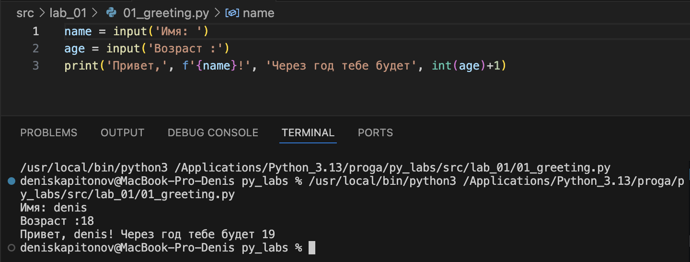
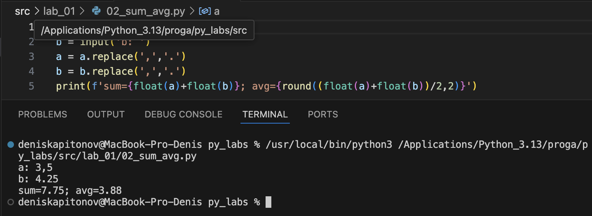
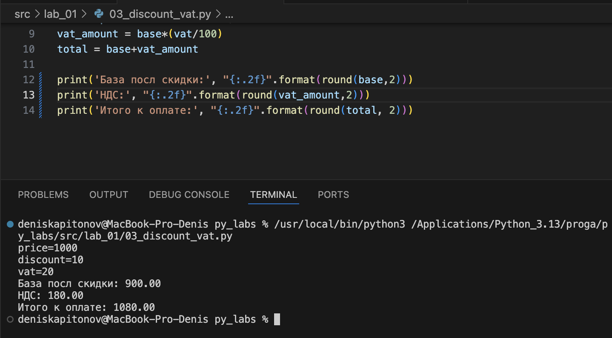
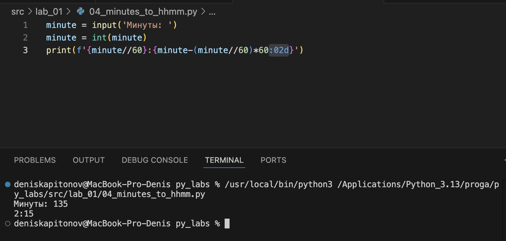
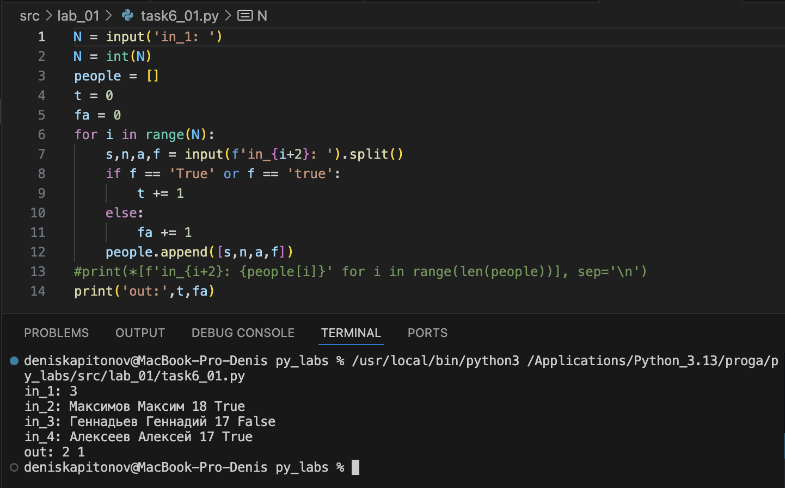
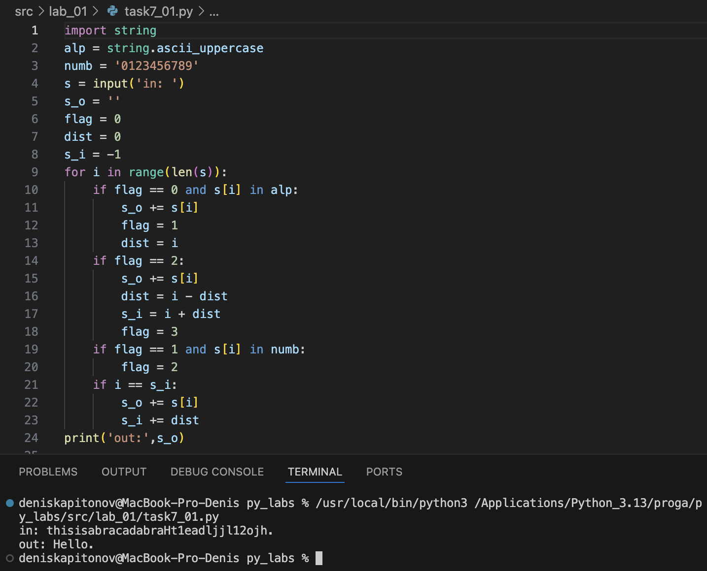

# Kapitonov_Denis

# Лабораторная работа 1
<h2>Задание 1</h2>

```python
name = input('Имя: ')
age = input('Возраст :')
print('Привет,', f'{name}!', 'Через год тебе будет', int(age)+1)
```



<h2>Задание 2</h2>

```python
a = input('a: ')
b = input('b: ')
a = a.replace(',','.')
b = b.replace(',','.')
print(f'sum={float(a)+float(b)}; avg={round((float(a)+float(b))/2,2)}')
```



<h2>Задание 3</h2>

```python
price = input('price=')
discount = input('discount=')
vat = input('vat=')
price = float(price)
discount = float(discount)
vat = float(vat)

base = price * (1 - discount/100)
vat_amount = base*(vat/100)
total = base+vat_amount

print('База посл скидки:', "{:.2f}".format(round(base,2)))
print('НДС:', "{:.2f}".format(round(vat_amount,2)))
print('Итого к оплате:', "{:.2f}".format(round(total, 2)))
```



<h2>Задание 4</h2>



```python
minute = input('Минуты: ')
minute = int(minute)
print(f'{minute//60}:{minute-(minute//60)*60:02d}')
```

<h2>Задание 5</h2>


```python
fio = input('ФИО: ')
fio = fio.split()
print('Инициалы:', fio[0][0]+fio[1][0]+fio[2][0])
print('Длина (символов):', len(fio[0])+len(fio[1])+len(fio[2])+2)
```

<h2>Задание 6</h2>



```python
N = input('in_1: ')
N = int(N)
people = []
t = 0
fa = 0
for i in range(N):
    s,n,a,f = input(f'in_{i+2}: ').split()
    if f == 'True' or f == 'true':
        t += 1
    else:
        fa += 1
    people.append([s,n,a,f])
#print(*[f'in_{i+2}: {people[i]}' for i in range(len(people))], sep='\n')
print('out:',t,fa)
```

<h2>Задание 7</h2>

```python
import string
alp = string.ascii_uppercase
numb = '0123456789'
s = input('in: ')
s_o = ''
flag = 0
dist = 0
s_i = -1
for i in range(len(s)):
    if flag == 0 and s[i] in alp:
        s_o += s[i]
        flag = 1
        dist = i
    if flag == 2:
        s_o += s[i]
        dist = i - dist
        s_i = i + dist
        flag = 3
    if flag == 1 and s[i] in numb:
        flag = 2
    if i == s_i:
        s_o += s[i]
        s_i += dist
print('out:',s_o)    

```

