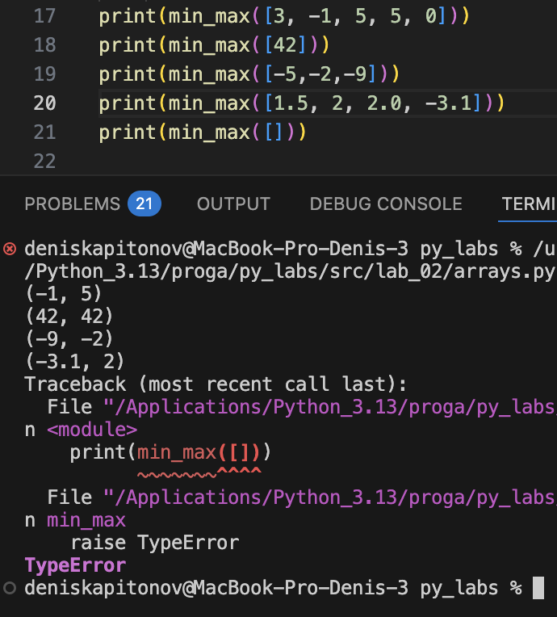
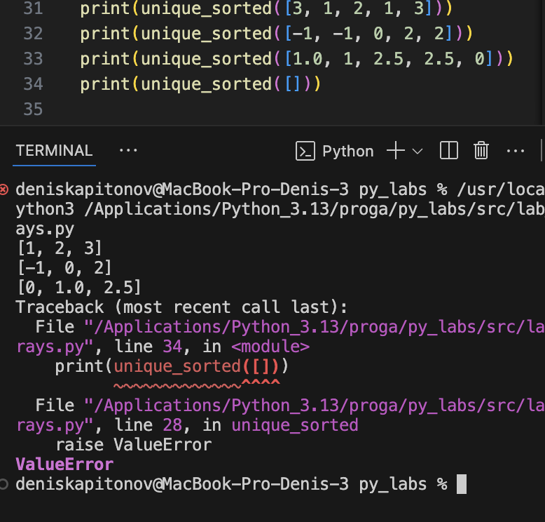
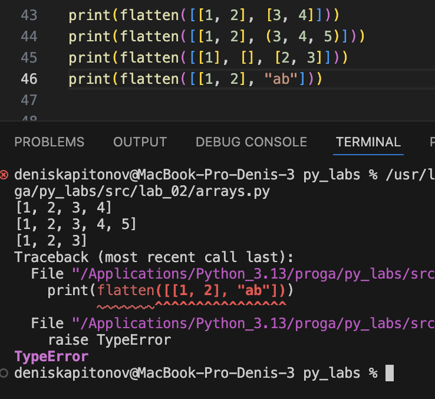
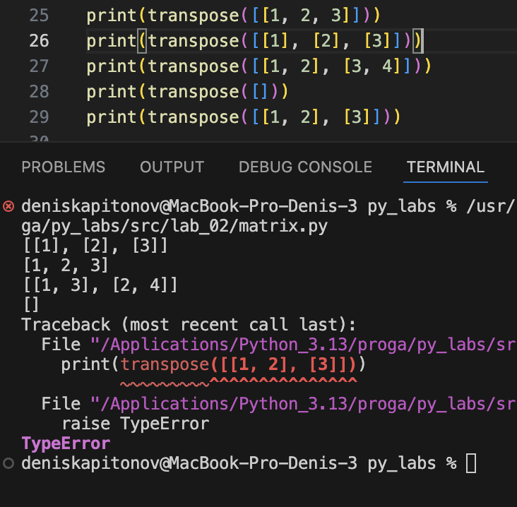
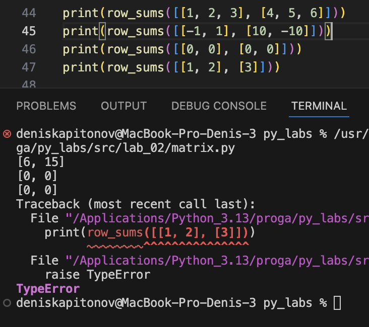
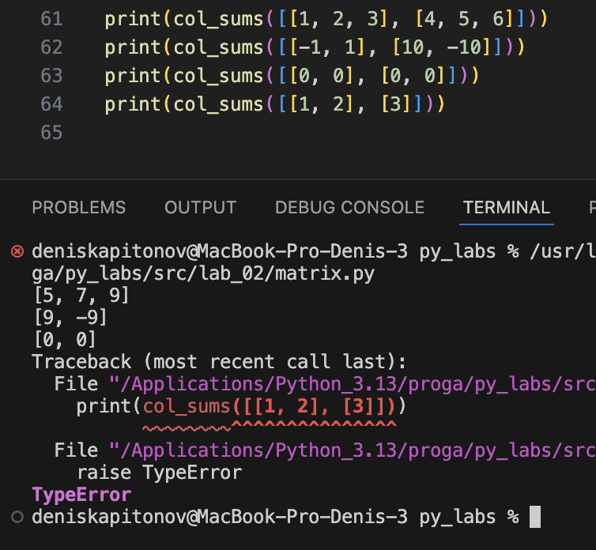
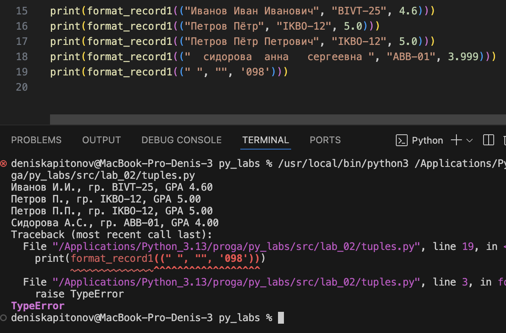

# ЛР2 — Коллекции и матрицы 

## Задание 1

### Задание 1.1

```python
def min_max(l):
    t = []
    Min = 10**9
    Max = -10**9
    for i in l:
        if i > Max:
            Max = i
        if i < Min:
            Min = i
        t.append(i)
    t = tuple(t)
    if len(l) == 0:
        raise TypeError
    else:
        return (Min,Max)
    
print(min_max([3, -1, 5, 5, 0]))
```




### Задание 1.2

```python
def unique_sorted(l):
    l = sorted(set(l))
    l = tuple(l)
    if len(l) == 0:
        return l
    else:
        return l
k = unique_sorted([3, 1, 2, 1, 3])

print(k)
```




### Задание 1.3

```python
def flatten(l):
    for i in l:
        if type(i) not in [list,tuple]:
            raise TypeError
    new_l = [j for i in l for j in i]
    return new_l
    
k = flatten([1.0, 1, 2.5, 2.5, 0])

print(k)    
```



## Задание 2

### Задание 2.1

```python
def transpose(l):
    new_l = []
    if len(l) == 0:
        return new_l
    for i in range(len(l)-1):
        if len(l[i]) != len(l[i+1]):
            raise TypeError
    if len(l) > len(l[0]):
        for i in l:
            for j in i:
                new_l.append(j)
    elif len(l) < len(l[0]):
        for i in l:
            for j in i:
                new_l.append([j])
    elif len(l) == len(l[0]):
        for i in range(len(l)):
            new = []
            for j in range(len(l)):
                new.append(l[j][i])
            new_l.append(new)
                
    return new_l 
```



### Задание 2.2

```python
def row_sums(l):
    new_l = []
    if len(l) == 0:
        return new_l
    for i in range(len(l)-1):
        if len(l[i]) != len(l[i+1]):
            raise TypeError
    for i in l:
        new_l.append(sum(i))
    return new_l
```



### Задание 2.3

```python
def col_sums(l):
    new_l = []
    if len(l) == 0:
        return new_l
    for i in range(len(l)-1):
        if len(l[i]) != len(l[i+1]):
            raise TypeError
    for i in range(len(l)-1):
        for j in range(len(l[0])):
            new_l.append(l[i][j]+l[i+1][j])
    return new_l
```



## Задание 3


```python
def format_record1(t):
    if len(t[0]) == 0 or len(t[1]) == 0 or type(t[2]) != float:
        raise TypeError
    fio = ''
    for i in t:
        s = i.split()
        for j in range(len(s)):
            if j == 0:
                fio = fio+s[j].title()+' '
            else:
                fio = fio+s[j][0].title()+'.'
        break
    return f'{fio}, гр. {t[1]}, GPA {"{:.2f}".format(round(t[2],2))}'

print(format_record1((" ", "ABB-01", 3.999)))
```

