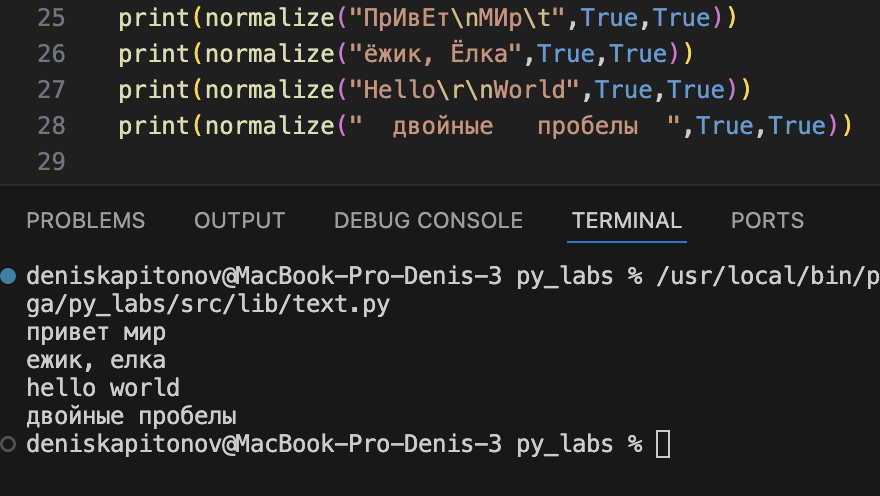
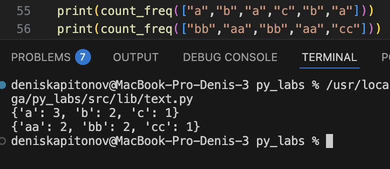
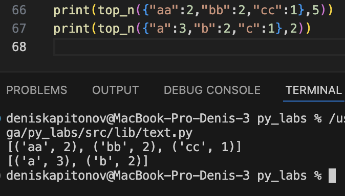
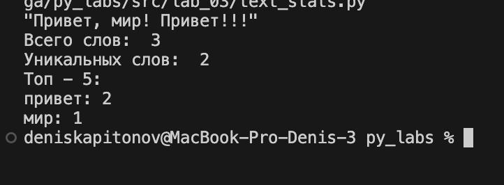

### ЛР3 — Тексты и частоты слов (словарь/множество)

## Заданеи 1

# Задание 1.1

```python
def normalize(text: str, casefold: bool, yo2e: bool) -> str:
    sym = ['\n','\r','\t','\\','\'','\"','\b','\f','\v']
    s = ''
    for i in sym:
        text = text.split(i)
        text = [i for i in text]
        s = ''
        for i in text:
            s += i+' '
        text = s
    if yo2e == True:
        text = text.replace('ё','е').replace('Ё','Е')
    if casefold == True:
        text = text.casefold()
    s = ''
    text = text.split()
    for i in range(len(text)):
        if i != len(text)-1:
            s += text[i]+' '
        else:
            s += text[i]
    return s
```



# Задание 1.2

```python
def tokenize(text: str) -> list[str]:
    for j in range(len(text)):
        if not((text[j] >= 'a' and text[j] <= 'z') or text[j] == '-' or text[j] == '+' or text[j] == '_' or (text[j] >= 'а' and text[j] <= 'я') or text[j] == ' ' or (text[j] >= '0' and text[j] <= '9')):
            text = text.replace(text[j], ' ')
            print(text[j])
    return text.split()
```


# Задание 1.3

```python
def count_freq(tokens: list[str]) -> dict[str, int]:
    set_tokens = set(tokens)
    arr_tokens = []
    dict_tokens = {}
    for i in set_tokens:
        arr_tokens.append([i,tokens.count(i)])
    arr_tokens = sorted(arr_tokens, key=lambda item: item[1], reverse = True)
    c=0
    for i in arr_tokens:
        dict_tokens[i[0]] = i[1]
        c+=1
    return dict_tokens

```



# Задание 1.4

```python
def top_n(freq: dict[str, int], n: int = 5) -> list[tuple[str, int]]:
    list_freq = []
    c=0
    for k, v in freq.items():
        if c < n:
            list_freq.append(tuple([k,v]))
        else:
            break
        c += 1
    return sorted(list_freq, key=lambda item: item[0], reverse = False)

```




## Задание 2

# Задание 2

```python
import sys
import os


sys.path.append('/Applications/Python_3.13/proga/py_labs/src/lib')
from text import *

text = input()
token = tokenize(normalize(text,True,False))
c_q = count_freq(tokenize(normalize(text,True,False)))
top = top_n(c_q)
print('Всего слов: ',len(token))
print('Уникальных слов: ',len(c_q))
print('Топ - 5: ')
for i in sorted((top), key=lambda item: item[1], reverse = True):
    print(f'{i[0]}: {i[1]}')
```

