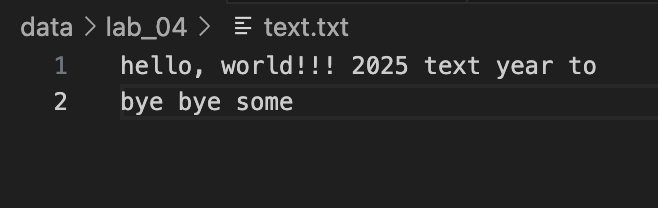
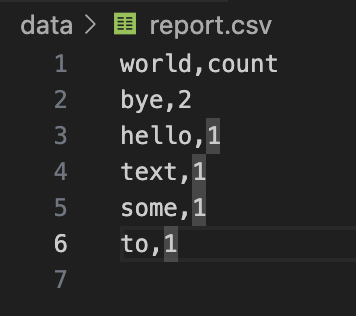
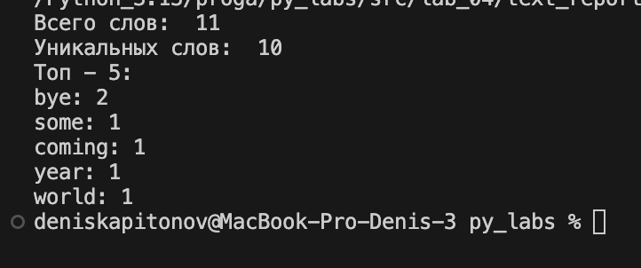

### ЛР4 — Файлы: TXT/CSV и отчёты по текстовой статистике

## Задание 1

```python
from pathlib import Path
import sys
import os
import csv
from typing import Iterable, Sequence

sys.path.append('/Applications/Python_3.13/proga/py_labs/src/lib')

from text import *


def is_ascii(s):
    return s.isascii()

def read_text(path: str | Path, encoding: str = "utf-8") -> str:
    p = Path(path)


    if not os.path.exists(p):
        raise FileNotFoundError
    
    # FileNotFoundError и UnicodeDecodeError пусть «всплывают» — это нормально
    text = p.read_text(encoding=encoding)

    if is_ascii(text) == False:
        raise UnicodeDecodeError
    else:
        return text
    
def write_csv(rows: Iterable[Sequence], path: str | Path,
              header: tuple[str, ...] | None = None) -> None:
    p = Path(path)
    rows = list(rows)
    word = [('world','count')]
    # print(rows)
    with p.open("w", newline="", encoding="utf-8") as f:
        w = csv.writer(f)
        w.writerow(*word)
        if header is not None:
            w.writerow(header)
        for r in rows:
            w.writerow(r)
    
t = read_text("/Applications/Python_3.13/proga/py_labs/data/lab_04/text.txt")
n = normalize(t,True,True)
token = tokenize(n)
c = count_freq(token)
topn = top_n(c)


write_csv(topn,'data/report.csv')
```



## Задание 2

```python
import sys
import os

sys.path.append('/Applications/Python_3.13/proga/py_labs/src/lib')
sys.path.append('/Applications/Python_3.13/proga/py_labs/data/lab_04')
from text import *
from io_txt_csv import *

t = read_text("/Applications/Python_3.13/proga/py_labs/data/lab_04/text.txt")
n = normalize(t,True,True)
token = tokenize(n)
c_q = count_freq(token)
top = top_n(c)

print('Всего слов: ',len(token))
print('Уникальных слов: ',len(c_q))
print('Топ - 5: ')
for i in sorted((top), key=lambda item: item[1], reverse = True):
    print(f'{i[0]}: {i[1]}')

write_csv(top,'data/report.csv')
```


