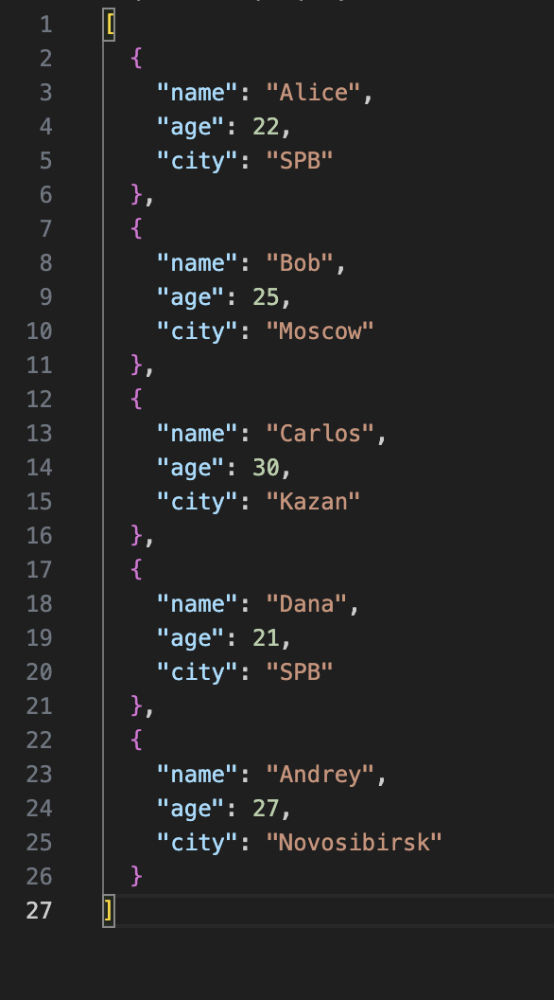
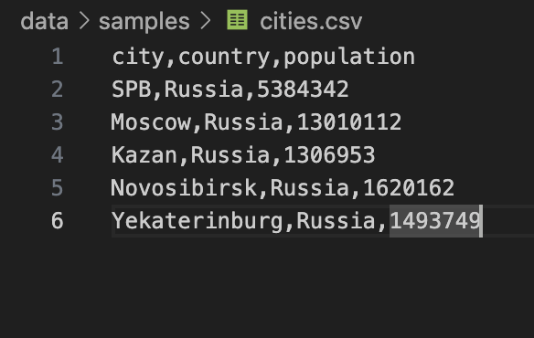

### ЛР5 — JSON и конвертации (JSON↔CSV, CSV→XLSX): Техническое задание

## Задание 1.1

```python
import json
from pathlib import Path
import sys
import os
import csv

sys.path.append('/Applications/Python_3.13/proga/py_labs/data/lab_04/')
from io_txt_csv import *

sys.path.append('/Applications/Python_3.13/proga/py_labs/src/lib')
from text import *

def json_to_csv(path: str | Path, path_json: str | Path) -> None:
    read_text(path)
    with open(path, 'r') as json_file:

        data_json = json_file.read()
    data = json.loads(data_json)
    if type(data) == list:
        data_n = []
        for i in data:
            data_tup = []
            for k,v in i.items():
                data_tup.append(str(v))
            data_n.append(tuple(data_tup))
        write_csv(data_n, path_json,('name','age','city'))
    else:
        for k,v in data.items():
                data[k] = str(v)
        data_n = top_n(data)
        write_csv(data_n, path_json,('age'))

    
    """
    Преобразует JSON-файл в CSV.
    Поддерживает список словарей [{...}, {...}], заполняет отсутствующие поля пустыми строками.
    Кодировка UTF-8. Порядок колонок — как в первом объекте или алфавитный (указать в README).
    """
path_csv = Path('/Applications/Python_3.13/proga/py_labs/data/samples/cities.csv')
path_json = Path('/Applications/Python_3.13/proga/py_labs/data/samples/people.json')


json_to_csv(path_json, '/Applications/Python_3.13/proga/py_labs/data/out/people_fron_json.csv')
csv_to_json(path_csv,'/Applications/Python_3.13/proga/py_labs/data/out/people_from_csv.json')
```



## Задание 1.2

```python
import json
from pathlib import Path
import sys
import os
import csv

sys.path.append('/Applications/Python_3.13/proga/py_labs/data/lab_04/')
from io_txt_csv import *

sys.path.append('/Applications/Python_3.13/proga/py_labs/src/lib')
from text import *

def csv_to_json(csv_path: str, json_path: str) -> None:
    """
    Преобразует CSV в JSON (список словарей).
    Заголовок обязателен, значения сохраняются как строки.
    json.dump(..., ensure_ascii=False, indent=2)
    """
    with open(csv_path, "r", newline="", encoding="utf-8") as f:
        """
            csv.DictWriter
        """
        data_csv = []
        
        csvreader = csv.reader(f)
        for row in csvreader:
            data_csv.append(row)
        data_dict_csv = []


        for i in range(len(data_csv)):
            dict_csv = {}
            if i != 0:
                print(len(data_csv[0]), data_csv[0])
                for j in range(len(data_csv[0])):
                        dict_csv[f'{data_csv[0][j]}'] = data_csv[i][j]
                data_dict_csv.append(dict_csv)
        

        # capitals_json = json.dumps(data_dict_csv)
        # with open(json_path, "w") as json_file:
        #     json_file.write(capitals_json)
        with open(json_path, 'w', encoding='utf-8') as f:
            json.dump(data_dict_csv, f, ensure_ascii=False, indent=4)

path_csv = Path('/Applications/Python_3.13/proga/py_labs/data/samples/cities.csv')
path_json = Path('/Applications/Python_3.13/proga/py_labs/data/samples/people.json')


json_to_csv(path_json, '/Applications/Python_3.13/proga/py_labs/data/out/people_fron_json.csv')
csv_to_json(path_csv,'/Applications/Python_3.13/proga/py_labs/data/out/people_from_csv.json')
```




## Задание 2


```python
import pandas as pd
from pathlib import Path
from openpyxl import Workbook
import csv
import sys

sys.path.append('/Applications/Python_3.13/proga/py_labs/data/lab_04/')
from io_txt_csv import *

def csv_to_xlsx(csv_path: str, xlsx_path: str) -> None:
    """
    Конвертирует CSV в XLSX.
    Использовать openpyxl ИЛИ xlsxwriter.
    Первая строка CSV — заголовок.
    Лист называется "Sheet1".
    Колонки — автоширина по длине текста (не менее 8 символов).
    """
    

    read_text(csv_path)


    wb = Workbook()
    ws = wb.active

    with open(csv_path, 'r', newline='', encoding='utf-8') as csvfile:

        reader = csv.reader(csvfile)
        

        for row in reader:
            ws.append(row)

    for column_cells in ws.columns:
  
        column_letter = column_cells[0].column_letter
        ws.column_dimensions[column_letter].auto_size = True
 
    wb.save(xlsx_path)


csv_path = Path('/Applications/Python_3.13/proga/py_labs/data/samples/people.csv')
xlsx_path = Path('/Applications/Python_3.13/proga/py_labs/data/out/people.xlsx')

csv_to_xlsx(csv_path,xlsx_path)
```


