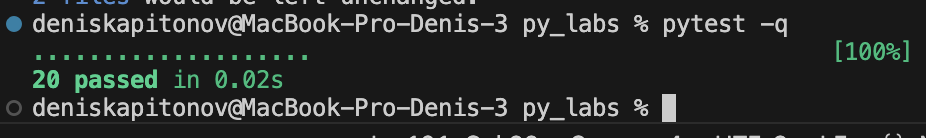
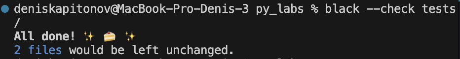

# ЛР7 — Тестирование: pytest + стиль (black)

## Задание 1

``` python
import pytest
import sys
import os

sys.path.append("/Applications/Python_3.13/proga/py_labs/src/lib")
from text import *


@pytest.mark.parametrize(
    "source, expected",
    [
        ("ПрИвЕт\\nМИр\\t", "привет мир"),
        ("ёжик, Ёлка", "ежик, елка"),
        ("Hello\\r\\nWorld", "hello world"),
        ("  двойные   пробелы  ", "двойные пробелы"),
        ("", ""),
    ],
)
def test_normalize_basic(source, expected):
    assert normalize(source) == expected


@pytest.mark.parametrize(
    "source, expected",
    [
        ("привет мир", ["привет", "мир"]),
        ("hello,world!!!", ["hello", "world"]),
        ("по-настоящему круто", ["по-настоящему", "круто"]),
        ("2025 год", ["2025", "год"]),
        ("emoji 😀 не слово", ["emoji", "не", "слово"]),
        ("", []),
    ],
)
def test_tokenize_basic(source, expected):
    # TODO: Реализовать тесты токенизации
    assert tokenize(source) == expected


@pytest.mark.parametrize(
    "source, expected",
    [
        (["a", "b", "a", "c", "b", "a"], {"a": 3, "b": 2, "c": 1}),
        (["bb", "aa", "bb", "aa", "cc"], {"aa": 2, "bb": 2, "cc": 1}),
        ([], None),
    ],
)
def test_count_freq_and_top_n(source, expected):
    # TODO: Реализовать тесты частоты
    assert count_freq(source) == expected


@pytest.mark.parametrize(
    "source, source2, expected",
    [
        ({"a": 3, "b": 2, "c": 1}, 2, [("a", 3), ("b", 2)]),
        ({"aa": 2, "bb": 2, "cc": 1}, 2, [("aa", 2), ("bb", 2)]),
        ({"aa": 2, "cc": 2, "bb": 2}, 2, [("aa", 2), ("bb", 2)]),
        ({}, 2, None),
    ],
)
def test_top_n_tie_breaker(source, source2, expected):
    # TODO: Реализовать тесты для топ_н
    assert top_n(source, source2) == expected

```


## Задание 2

```python
import pytest
import sys
import os

sys.path.append("/Applications/Python_3.13/proga/py_labs/src/lab_05")
from json_csv import *


def test_json_to_csv_roundtrip(tmp_path: Path):
    src = tmp_path / "people.json"
    dst = tmp_path / "people.csv"
    data = [
        {"name": "Alice", "age": 22},
        {"name": "Bob", "age": 25},
    ]
    src.write_text(json.dumps(data, ensure_ascii=False, indent=2), encoding="utf-8")
    json_to_csv(str(src), str(dst))

    with dst.open(encoding="utf-8") as f:
        rows = list(csv.DictReader(f))

    assert len(rows) == 2
    assert {"name", "age"} <= set(rows[0].keys())


def test_csv_to_json_roundtrip(tmp_path: Path):
    # TODO: Реализовать тесты для конвертации в другую сторону
    src = tmp_path / "people.csv"
    dst = tmp_path / "people.json"

    data = "name,age\nAlice,22\nBob,25\n"

    src.write_text(data, encoding="utf-8")

    csv_to_json(str(src), str(dst))

    with dst.open(encoding="utf-8") as f:
        result = json.load(f)

    assert len(result) == 2
    assert result[0]["name"] == "Alice"
    assert result[1]["age"] == "25"

```


