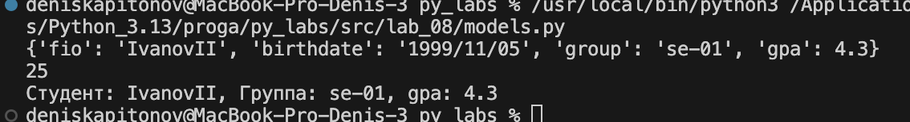
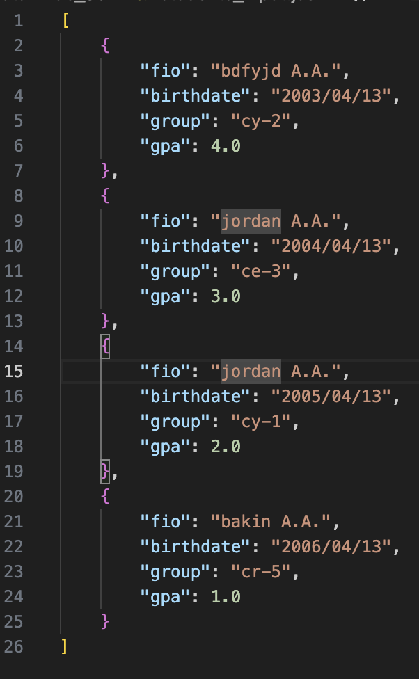
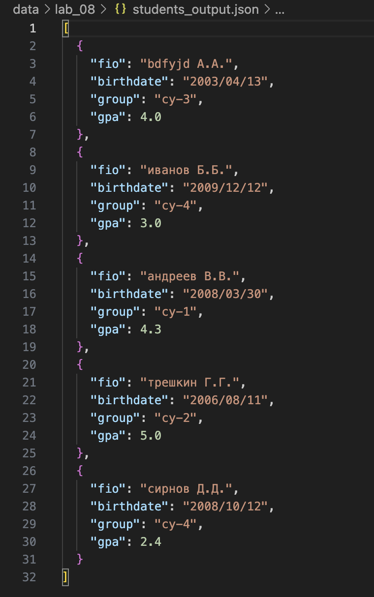

### ЛР8 – ООП в Python: @dataclass Student, методы и сериализация

## задание 1

```python
from datetime import datetime, date
from dataclasses import dataclass

@dataclass
class Student:
    fio: str
    birthdate: str
    group: str
    gpa: float

    def __post_init__(self):
        # TODO: добавить нормальную валидацию формата даты и диапазона gpa
        try:
            datetime.strptime(self.birthdate, "%Y/%m/%d")
        except ValueError:
            # (по-хорошему, тут должен быть raise ValueError(...))
            raise ValueError
        
        if not (0 <= self.gpa <= 5):
            raise ValueError("gpa must be between 0 and 5")

    def age(self) -> int:
        # TODO: добавить нормальную валидацию формата даты и диапазона gpa
        b = datetime.strptime(self.birthdate, "%Y/%m/%d").date()
        today = date.today()
        year = 1
        if today.day < b.day and today.month >= b.month:
            year = 0
        return today.year - b.year - year

    def to_dict(self) -> dict:
        # TODO: проверить полноценность полей
        return {
            "fio": self.fio,
            "birthdate": self.birthdate,
            "group": self.group,
            "gpa": self.gpa,
        }

    @classmethod
    def from_dict(cls, d: dict):
        # TODO: реализовать десереализацию из словаря

        return cls(fio=d["fio"],
                   birthdate=d["birthdate"],
                   group=d["group"],
                   gpa=float(d["gpa"]))

    def __str__(self):
        # TODO: f"{}, {}, {}"
        return f"Студент: {self.fio}, Группа: {self.group}, gpa: {self.gpa}"
    
if __name__ == '__main__':
    student1 = Student("IvanovII", '1999/11/05', 'se-01', 4.3)
    student1.to_dict()
    dic = {'fio': 'smirnovII', 'birthdate': '1925/12/20', 'group': 'gte-23', 'gpa': '3.2'}
    Student.from_dict(dic)
    print(student1.age())
    print(student1.__str__())
```



## задание 2

```python
import json
from models import Student

students = [
    Student(fio="bdfyjd А.А.", birthdate="2003/04/13", group="су-3", gpa=4.0),
    Student(fio="иванов Б.Б.",   birthdate="2009/12/12", group="су-4", gpa=3.0),
    Student(fio="андреев В.В.", birthdate="2008/03/30", group="су-1", gpa=4.3),
    Student(fio="трешкин Г.Г.", birthdate="2006/08/11", group="су-2", gpa=5.0),
    Student(fio="сирнов Д.Д.", birthdate="2008/10/12", group="су-4", gpa=2.4)
]
def students_to_json(students, path):
    # data = dict.fromkeys(students, 'student')
    # data = {f'students_{i+1}': students[i] for i in range(len(students))}
    data = [s.to_dict() for s in students]
    # json.dumps(data, ensure_ascii=False, indent=2)
    with open(path, 'w', encoding='utf-8') as f:
        json.dump(data, f, ensure_ascii=False, indent=2)

def students_from_json(path):
    with open(path, 'r', encoding="utf-8") as json_file:
        data_json = json.load(json_file)
    # data_dict = json.loads(data_json)
    # data = [i for i in data_dict.values()]
    return [Student.from_dict(d) for d in data_json]

if __name__ == '__main__':
    to = students_to_json(students,'data/lab_08/students_output.json')
    fromt = students_from_json('data/lab_08/students_input.json')
    for i in fromt:
        print(i)
```


