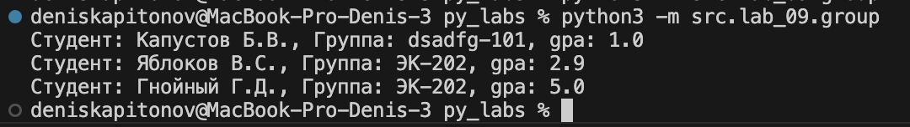
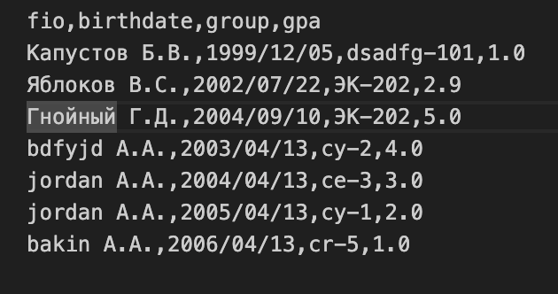
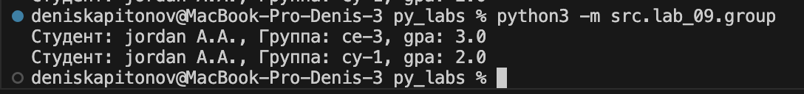
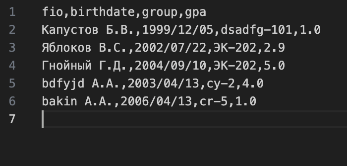
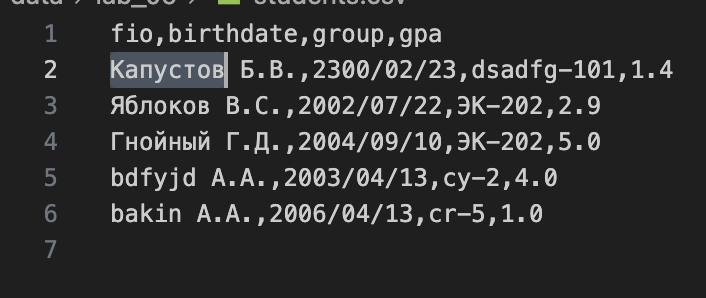

### ЛР9 — «База данных» на CSV: класс Group, CRUD-операции и CLI

## задание 1


```python

from dataclasses import dataclass
from pathlib import Path
from src.lab_08.models import Student
from src.lab_08.serialize import students_from_json
import csv

class group:
    path: str
    fieldnames: list 

    def __init__(self, storage_path):
        self.path = Path(storage_path)
        self.fieldnames = ['fio','birthdate','group','gpa'] 
        if not self.path.exists():
            self.path.write_text("", encoding="utf-8")
    
    def _read_all(self):
        arr_dict = []
        # TODO: реализовать чтение строк из csv 
        with open(self.path, "r", newline="", encoding="utf-8") as f:
            reader = csv.DictReader(f)
            for row in reader:
                arr_dict.append(row)
        return [Student.from_dict(d) for d in arr_dict]
    
    def list(self):
        return self._read_all()
    
    def add(self, student: Student):
         # TODO: реализовать метод add()
         with open(self.path, 'a', newline='', encoding='utf-8') as f:
            writer = csv.DictWriter(f, fieldnames=self.fieldnames, extrasaction='ignore')
            writer.writerow(student.to_dict())
    
    def find(self, substr: str):
        arr = self._read_all()
        return [r for r in arr if substr in r.fio]
    
    def remove(self, fio: str):
        # TODO: реализовать метод remove()
        arr = self._read_all()
        arr_fio = []
        for i, r in enumerate(arr):
            print(fio in r.fio, r.fio, i)
            if fio.lower() in r.fio.lower():
                arr_fio.append(r)
        for i in arr_fio:
            arr.remove(i)
        with open(self.path, 'w', newline='', encoding='utf-8') as f:
            writer = csv.DictWriter(f, fieldnames=self.fieldnames, extrasaction='ignore')
            writer.writeheader()
            for i in arr:
                writer.writerow(i.to_dict())
    def update(self, fio: str, **fields):
        # TODO: реализовать метод update()
        with open(self.path, 'r', newline='', encoding='utf-8') as f:
            reader = csv.DictReader(f)
            arr = [Student.from_dict(i) for i in [d for d in reader]]
            for row in arr:
                if fio in row.fio:
                    for key, val in fields.items():
                        setattr(row, key, val)
        with open(self.path, 'w', newline='', encoding='utf-8') as f:
            writer = csv.DictWriter(f, fieldnames=self.fieldnames, extrasaction='ignore')
            writer.writeheader()
            for i in arr:
                writer.writerow(i.to_dict())
                

if __name__ == "__main__":
     students = students_from_json("data/lab_08/students_input.json")
     gp = group('data/lab_09/students.csv')
    #  for i in students:
    #     gp.add(i)
    #  arr = gp.list()
    #  for i in arr:
    #     print(i)
    #  fnd = gp.find('jordan')
    #  for i in fnd:
    #     print(i)
    #  gp.remove('jordan')
     gp.update("Борисов Б.В.",birthdate = '1999/12/05',group='dsadfg-101',gpa=1.0)

```





